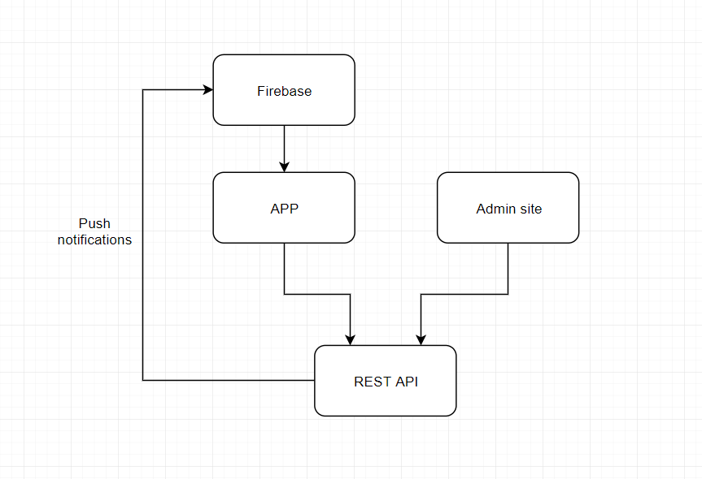



## Appetize, School-food feedback app


# Links

Planning board https://github.com/te4umea2019/appetize/projects/1

Admin site and API https://appetize.umea-ntig.se/

# Installation and setup

## Server installation

Prerequisites

-   NodeJS
-   MySQL

1. Clone this project `git clone https://github.com/te4umea2019/appetize && cd appetize`
1. Configure `config.json`
1. Import database `mysql -u username < appetize.sql`
1. Install packages `cd server && npm i`
1. Start the project `node index.js`

## Build for IOS

Prerequisites

-   An apple computer running macOS 14
-   Flutter
-   Xcode

1. Clone this project `git clone https://github.com/te4umea2019/appetize && cd appetize`
1. Run `open app/ios/Runner.xcworkspace`
1. Configure the build in xcode and run!

# Systems description



# API

## POST /api/profile

Submit your profile form for today.
"vote" is how much you liked the food, from 0 (bad) to 3 (good).
"comments" is an array of optional comments added by the user.
"id" is the users APPETIZE_ID that is unique to them and can be acquired via POST /api/register.

```json
REQUEST {
    "vote": 3,
    "comments": ["Kall mat", "Lång kö"],
    "id": "APPETIZE_9CE5C3ECFF28354878AA51592797E37F"
}

RESPONSE {
    "success": true,
    "text": "Success!"
}
```

## GET /api/profile

Get your profile from the server. Basically a login.

```json
REQUEST {
    "id": "APPETIZE_9CE5C3ECFF28354878AA51592797E37F"
}

RESPONSE {
    "success": true,
    "text": "Success!",
    "profile": {
        "class": "TE17",
        "restaurant": "Greek",
        "vote": 3,
        "comments": ["Kall mat", "Lång kö"],
        "messages": [
            {
                content: "Message content goes here",
                id: 9842384732
            }
        ]
    }
```

## POST /api/register

Register an APPETIZE account

```json
REQUEST {
    "code": "ABCD"
}

RESPONSE {
    "success": true,
    "text": "Success!",
    "id": "APPETIZE_9CE5C3ECFF28354878AA51592797E37F"
}
```

## POST /api/login

Login as an admin

```json
REQUEST {
    "username": "admin",
    "password": "admin"
}

RESPONSE {
    "success": true,
    "token": "APPETIZE_9CE5C3ECFF28354878AA51592797E37F",
    "text": "Wrong password"
}
```
